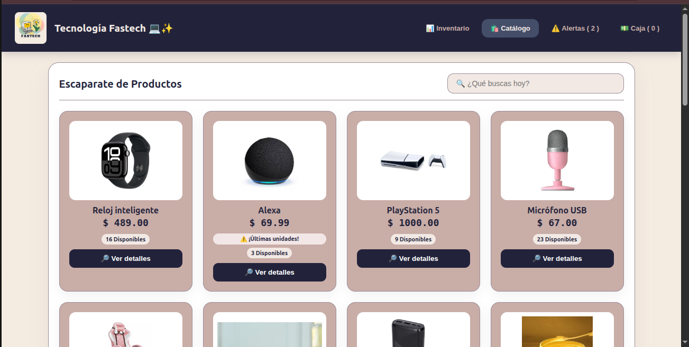
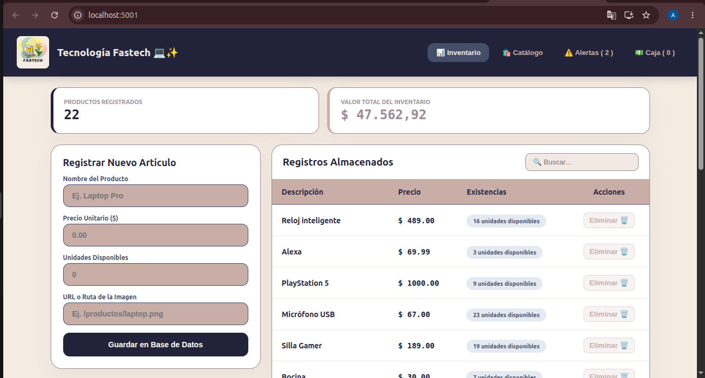

# 💻 Tienda Tecnológica Fastech ✨
> Sistema integral de gestión de inventario, catálogo de productos y control simulado de ingresos.

Proyecto full-stack desarrollado para la gestión moderna de dispositivos tecnológicos, con una interfaz visual intuitiva, componentes redondeados y una paleta de colores estética.

## 📱 Demostración Visual del Sistema

Aquí puedes ver cómo luce y funciona la interfaz de **Fastech**:

### Vista del Catálogo


### Panel de Inventario


---

## 🎨 Características del Proyecto
* **📊 Gestión de Inventario:** Panel administrativo completo conectado a una base de datos relacional para dar de alta y eliminar productos en tiempo real.
* **🛍️ Catálogo de Productos:** Vista de cara al cliente con barra de búsqueda funcional por coincidencia de nombres.
* **⚡ Detalle de Compra & Simulación:** Vista expandida del producto con validación de stock y simulación inmediata de transacciones.
* **💵 Control de Caja:** Bitácora en tiempo real que registra la hora exacta, artículo y monto percibido de las ventas simuladas durante la sesión.
* **⚠️ Sistema de Alertas:** Notificaciones automáticas para productos con stock crítico (menor o igual a 3 unidades).

---

## 🛠️ Tecnologías Utilizadas

### Frontend
* **React.js** (Estructura de componentes y manejo de estados locales)
* **CSS en línea** (Estilo personalizado basado en una paleta pastel: lila, coral y variantes oscuras)

### Backend & Base de Datos
* **Node.js** con **Express** (API REST para la comunicación de datos)
* **MySQL** (Almacenamiento persistente de productos e inventario)

---

## 📂 Estructura del Repositorio

El repositorio está estructurado en un solo lugar de la siguiente manera:
* `src/` - Código fuente de la aplicación de React.
  * `src/componentes/` - Componentes modulares (`Navbar`, `Inventario`, `Catalogo`, `DetalleCompra`, `Alertas`, `Caja`).
* `public/` - Archivos públicos e imágenes estáticas del cliente.
* `databases.js` - Configuración del servidor de Express y conexión a la base de datos MySQL.
* `.env` - Variables de entorno y credenciales (excluido de Git por seguridad).

---

## 🚀 Instrucciones de Instalación y Uso

Sigue estos pasos para clonar y ejecutar el proyecto localmente en tu entorno Linux:

### 1. Clonar el repositorio
```bash
git clone [https://github.com/ptrincessh/Fastech-Tienda.git](https://github.com/ptrincessh/Fastech-Tienda.git)
cd Fastech-Tienda
